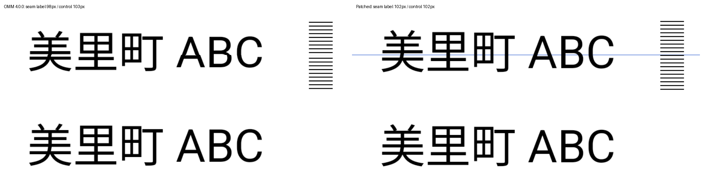

# OMM masked raster tile seam reproduction

Standalone Android reproduction of distorted raster content at a tile seam in
`io.openmobilemaps:mapscore:4.0.0`. OMM is the only map dependency; the remaining
libraries supply Android Activity/lifecycle support. There is no vector tile
renderer, external map service, API key, or network requirement. A loopback HTTP
server serves PNGs generated using Android `Canvas`.

The project follows the small, self-contained reproduction approach used in
[OMM issue #927](https://github.com/openmobilemaps/maps-core/issues/927).
This report concerns raster texture alignment; #927 concerns layer removal.

## What to look for

The same `美里町 ABC` text is drawn twice on **one 2048×2048 bitmap**. The upper
label crosses y=1024, the boundary between tile rows 7 and 8 at z=4. The lower
label is 200 image pixels below it, wholly inside a tile. A blue horizontal line
marks that boundary; a black ladder makes scanline discontinuities visible.
Four 1024×1024 PNGs are cropped from that bitmap. No glyph is independently
positioned or rendered on either side of the seam.

The app uses `DefaultTiled2dMapLayerConfigs.webMercatorCustom` and
`Tiled2dMapZoomInfo(1f, 0, 0, true, true, false, true)`. It leaves the default
quad/stencil rendering path enabled and does not opt into mask-tile geometry.

**Expected:** both labels have the same shape/height, and the blue line remains visible.

**Actual with Maven OMM 4.0.0:** the upper label is compressed at the seam and
the blue line disappears. The lower label renders normally.



## Run the stock version

Requires JDK 17+, Android SDK 37, and an arm64 Android device supporting OMM
(minimum API 28 for this sample; OMM requires OpenGL ES 3.2). Gradle supplies
Kotlin 2.4.10 through AGP's built-in Kotlin support.

```sh
git clone https://github.com/wf9a5m75/maps-core-raster-seam-repro.git
cd maps-core-raster-seam-repro
# Set ANDROID_HOME/ANDROID_SDK_ROOT, or configure sdk.dir in local.properties.
./gradlew :app:installDebug
adb shell am start -n com.example.ommseam/.MainActivity
adb logcat -s OmmSeam
```

The app starts with `maskTile=true`. Drag to pan and press **Reset camera** to
return to the initial position. **Toggle mask** rebuilds the map with the other
mask setting. For a repeatable unmasked control:

```sh
adb shell am force-stop com.example.ommseam
adb shell am start -n com.example.ommseam/.MainActivity --ez mask false
```

## Build the patched native library and compare

`patches/flat-masked-raster-overlap.patch` changes one C++ call: for flat raster
layers using stencil tile masking, the texture quad uses zero overlap. Unmasked
and globe layers keep the existing `1/512` overlap, and mask-tile geometry is
unchanged. Expanding a texture quad before clipping it to the original tile's
stencil mask discards image rows/columns at the boundary.

Install Android NDK **27.1.12297006**, CMake **3.22.1**, and Build Tools **35.0.0**
(the corresponding `NDK_VERSION`, `CMAKE_VERSION`, and `BUILD_TOOLS_VERSION`
environment variables can select other installed versions).

```sh
./scripts/build-patched-apk.sh
adb install --no-incremental -r app/build/outputs/apk/debug/app-patched.apk
adb shell am force-stop com.example.ommseam
adb shell am start -n com.example.ommseam/.MainActivity --ez mask true
```

The script clones OMM's 4.0.0 source into `build/maps-core`, initializes its
submodules, applies the patch, and builds `libmapscore.so` for arm64. It replaces
only that library in the stock debug APK and signs a separate APK with the local
debug key. Kotlin/Java code, resources, input images, and the published Maven
cache remain the same. An existing OMM checkout can be passed as the first
argument; the patch is detected if already applied.

## Device verification and evidence

Pixel 5a, Android 14, arm64-v8a, flat map, landscape, reset camera. Captured on
2026-10-07. The patched library was built from upstream `main` at `ca61ceb` plus
the patch (raster implementation identical to the 4.0.0 source apart from the fix).

| Image | Label crossing seam | Identical label inside tile |
| --- | ---: | ---: |
| Maven OMM 4.0.0 | 98px | 103px |
| Patched OMM | 102px | 102px |

Bounds use pixels whose RGB components are all below 100. These are screenshot
measurements at one camera position, not font size specifications. The control
can shift by one pixel because the expanded quad also changes its sampling grid.
The missing blue line and compressed seam strokes are the visible failure.

- [Before](evidence/before.png), [after](evidence/after.png), and [comparison](evidence/comparison.png).
- [Original bitmap](evidence/input/source.png) and its four cropped PNGs in `evidence/input/`.
- Combining those four PNGs reconstructs the original bitmap **byte-for-byte in decoded RGBA**.
- The map region of [unmasked before](evidence/unmasked-before.png) and [unmasked after](evidence/unmasked-after.png) is **pixel-identical**.
- Panning with the patched masked layer keeps the line and labels continuous.
- Globe and mask-tile-geometry paths were not exercised; the patch preserves their existing behavior.

Verify the checked-in evidence (this analyzes the saved captures; it does not drive a device):

```sh
python3 -m pip install Pillow
python3 scripts/verify-evidence.py
```

Pull newly generated input PNGs and take a screenshot:

```sh
adb pull /sdcard/Android/data/com.example.ommseam/files/ ./device-input
adb exec-out screencap -p > device-screen.png
```

The source bitmap is generated on the test device, so glyph rasterization is
consistent within each run even if a different device has different fonts.
